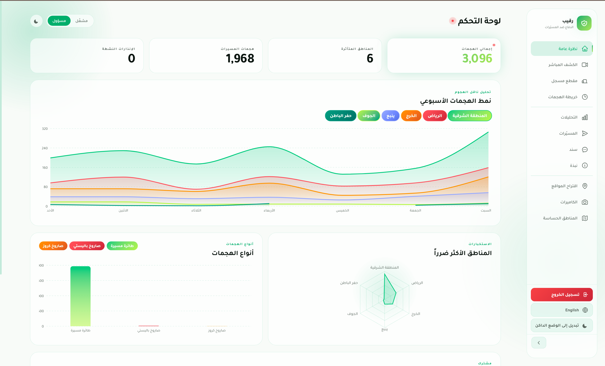
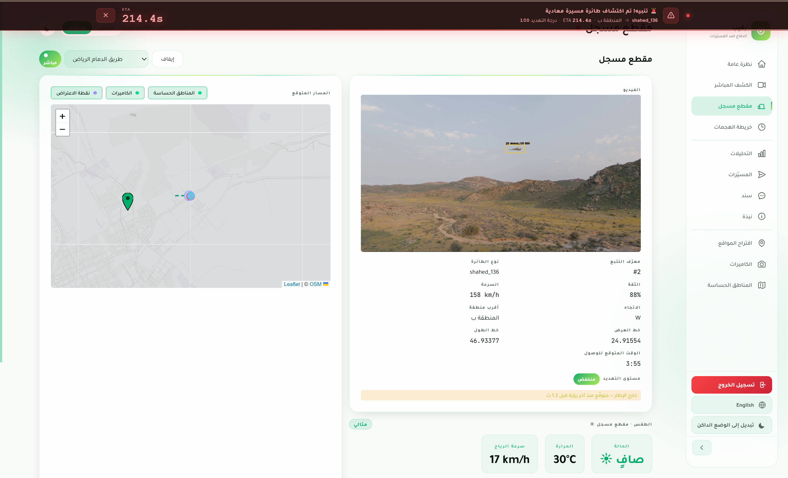
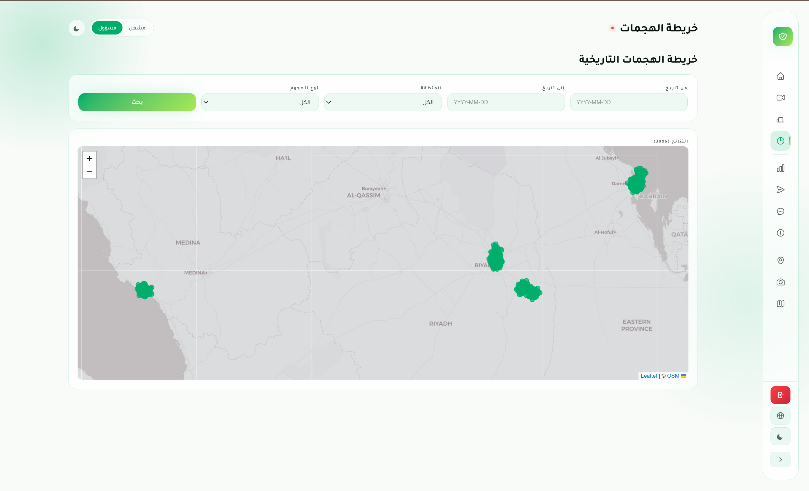
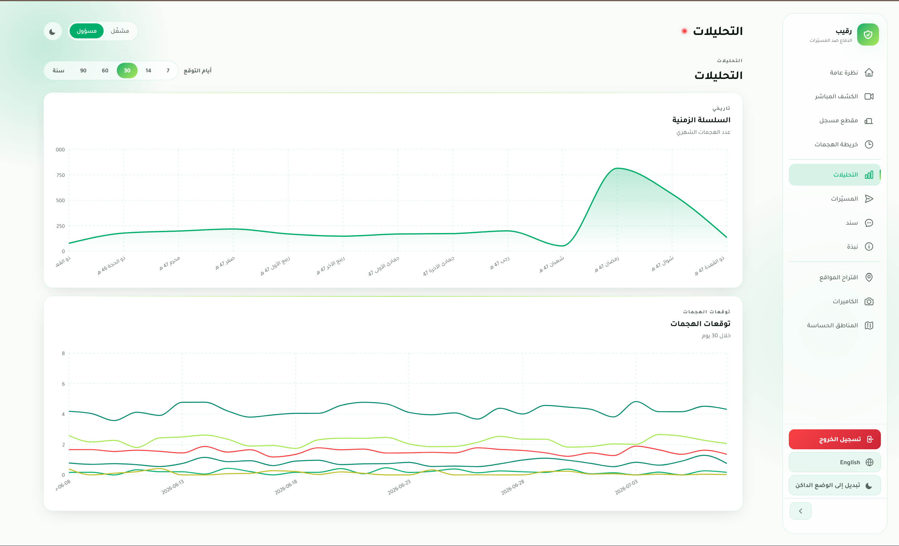
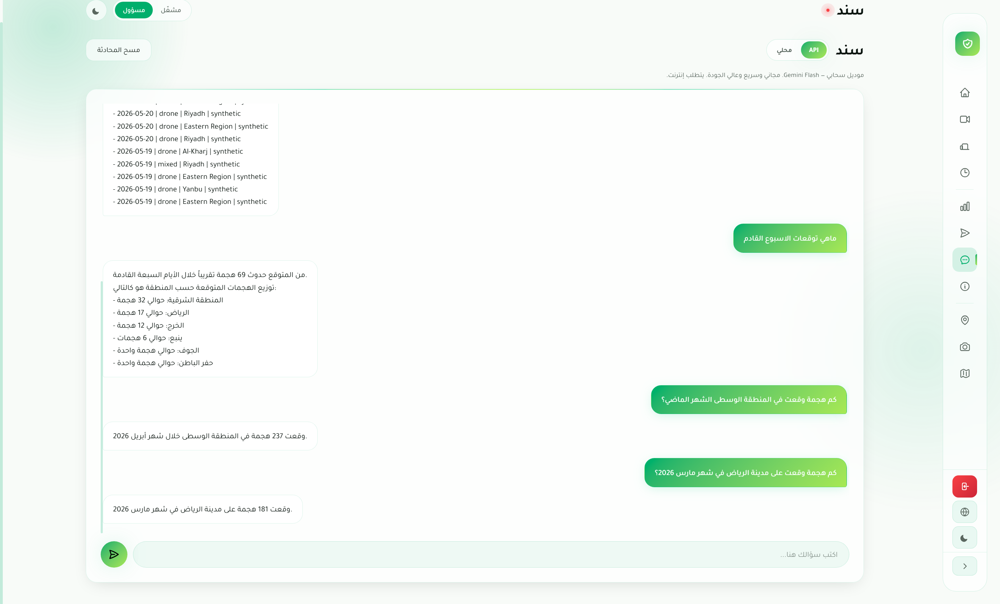

# رقيب | Raqeeb  AI Drone Detection & Defense Platform

Raqeeb is an AI-powered drone detection & defense platform that turns existing camera infrastructure into a real-time threat monitoring network. It uses computer vision to detect and classify hostile drones, tracks them frame-to-frame, converts their pixel position into real-world GPS coordinates, and calculates their speed, heading, and estimated time of arrival to a target. A bilingual (Arabic/English) dashboard displays live alerts, historical attack analysis, and forecasted threat patterns, backed by an AI assistant that answers natural-language questions about the data.

---

## What Raqeeb Does

1. **Detects** hostile drones in live video and distinguishes them from birds and civilian aircraft, using a computer vision model trained on 6 target classes.
2. **Tracks** each target continuously, assigning it a persistent identity across frames.
3. **Projects** its pixel position onto real-world GPS coordinates.
4. **Calculates** speed, heading, predicted path, estimated time of arrival, and the optimal interception point.
5. **Classifies threat level** (critical / high / low) using a model that combines drone type, speed, heading, time of day, and proximity to critical infrastructure.
6. **Alerts** operators before impact, through a fully bilingual (Arabic/English) live dashboard with historical analysis and forecasting.

---

## Key Features

- 📊 **Live Dashboard** — real-time overview of active threats, alerts, and affected regions
- 🎥 **Live & Recorded Detection** — per-target readout (type, speed, heading, GPS, confidence, ETA, threat level) over a live camera feed or recorded clip
- 🗺️ **Historical Attack Map** — filterable by date, region, and drone type, with geographic clustering
- 📈 **Analytics & Forecasting** — historical trend analysis and 30-day attack forecasting powered by XGBoost
- 📷 **Optimal Camera Placement** — KMeans-based suggestions for new camera locations based on attack density
- 🤖 **Sanad (سند)** — a bilingual (Arabic/English) AI decision-support assistant that answers natural-language questions about the data and forecasts future patterns, with a switch between a fine-tuned local Qwen 2.5 model and the Gemini API
- 🌤️ **Weather-Aware Detection** — accounts for weather conditions in detection confidence

---

## Screenshots

**Live Dashboard**

**Live Detection & Threat Assessment**

**Historical Attack Map**

**Analytics & Forecasting**

**Sanad — AI Assistant**

## Demo Video

📺 [Full system walkthrough on YouTube](https://youtu.be/SiWSk-FkzSk)

---

## Model Performance

| Class | Images | Instances | Precision | Recall | mAP50 | mAP50-95 |
|---|---|---|---|---|---|---|
| **All** | 1447 | 1519 | 0.966 | 0.945 | 0.968 | **0.822** |

Inference speed: ~1.9ms preprocess, ~4.4ms inference, ~0.1ms postprocess per image.

The model is trained across 6 classes, including specific drone types like **Shahed-136** and **Orlan-10**, alongside birds and civilian aircraft to minimize false positives.

---

## Tech Stack

**Computer Vision & ML**
- YOLO26 (Ultralytics) for detection NMS-free and DFL-free, for faster, simpler inference
- ByteTrack with tuned `track_buffer` for multi-object tracking
- XGBoost for attack forecasting
- KMeans for optimal camera placement suggestions

**Backend**
- FastAPI
- Supabase (PostgreSQL)
- Alembic migrations
- Python managed via `uv`

**Frontend**
- React + TypeScript + Vite

**AI Assistant (Sanad)**
- Fine-tuned Qwen 2.5 (via Ollama, local inference) with a live switch to the Gemini API

---

## Team

Built by **Rana Almohaimeed**, **Leen AlJamaan**, and **Abdullah Almudayfir** as part of Tuwaiq Academy's AI Solutions Development Bootcamp, in collaboration with GEOSA.

---

## License

All rights reserved. This project is shared publicly for portfolio and demonstration purposes only. It may not be copied, reused, or distributed without explicit written permission from the author.

